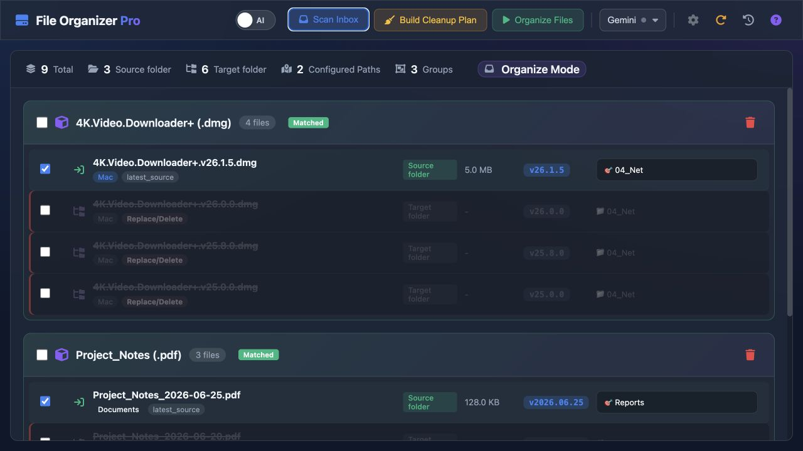
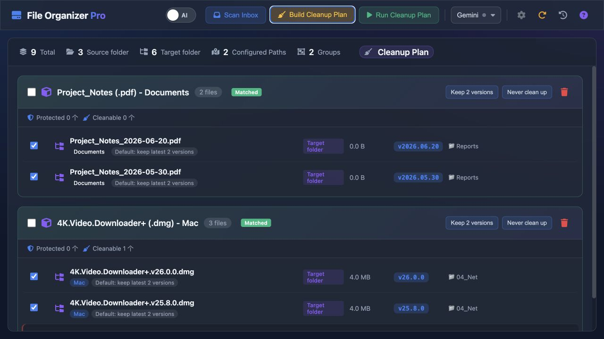
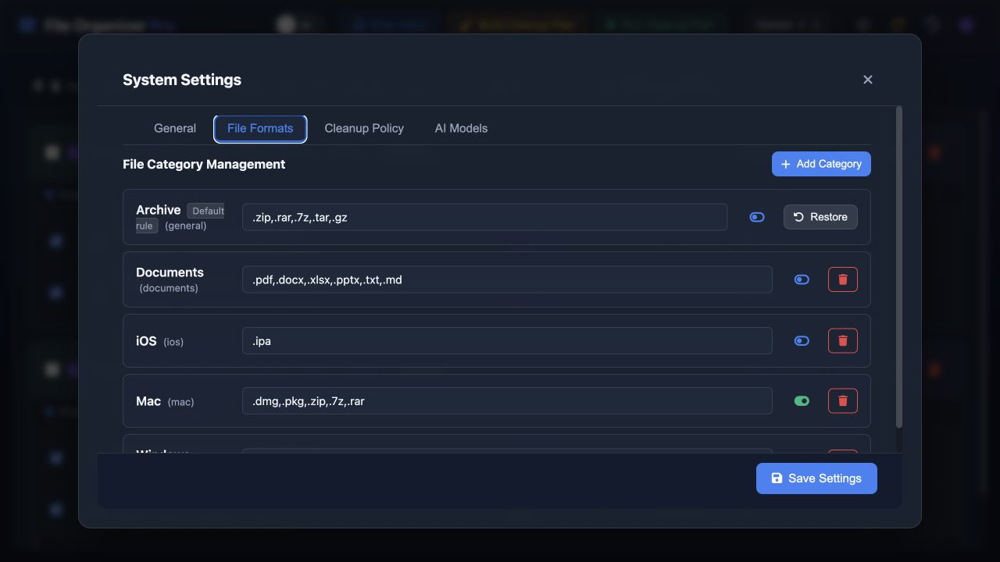

# File Organizer Pro

Local-first file, document, and software-package organizer for macOS and Windows.

[](https://github.com/roanpy/file-organizer/actions/workflows/ci.yml)
[](CHANGELOG.md)
[](RELEASING.md)
[](https://github.com/roanpy/file-organizer/releases)
[](https://www.python.org/)
[](RELEASING.md)
[](LICENSE)

English is the primary project language. The UI selects Chinese for `zh-*` system locales and English for other system locales; no translation service or external CDN is used. 中文说明见 [README.zh-CN.md](README.zh-CN.md)。



<p align="center"><sub>Actual UI from the current source tree with an isolated demo directory and synthetic filenames. No real project, local path, API key, or business content is shown.</sub></p>

## Interface Preview

### Cleanup Plan



### File Format Settings



## What It Does

- Scans an inbox recursively and groups files by category, name, version, and date.
- Matches files whose names differ by punctuation, platform labels, release tags, or packaging format.
- Uses file-name versions or dates first; falls back to filesystem modification time when neither is available.
- Recommends target folders from existing local structure and supports manual review before transfer.
- Builds a cleanup plan for old or duplicate versions with per-group retention policies.
- Protects selected files, keywords, folders, variants, and historical versions from batch cleanup.
- Supports configurable document, archive, Mac, iOS, Windows, and custom categories.

## Problems Addressed

- Name matching tolerates punctuation, separators, version tags, dates, platform labels, and packaging differences without collapsing similar products such as `open-codesign` and `open-design`.
- Version ordering uses an explicit filename version or date first, then filesystem modification time as a visible fallback when a document has no usable version marker.
- Cleanup separates keep, protected, replace, and delete candidates so historical files can be retained by group, keyword, folder, variant, or individual rule.
- AI provider failures, missing configuration, and unavailable models do not block local scanning, matching, cleanup planning, transfer, or deletion safeguards.

## System Characteristics

- Local-first and source-first: the core workflow runs on the user's machine with a small Python dependency set and an embedded framework-free frontend.
- AI is an optional decision aid, not a required service. Gemini, DeepSeek, and Ollama use HTTP calls; no AI SDK is required for the core application.
- Destructive actions are reviewable and bounded by configured roots. Same-name overwrite requires an explicit confirmation choice, and transfer failures prevent unsafe cleanup.
- The interface follows the operating system language: Chinese for `zh-*` locales and English for other locales. On macOS desktop builds, the native ordered language preference is read before Qt, environment variables, or the browser locale, so `zh-Hans-US` still wins when the process runs under `C.UTF-8`. Translation is local and has no CDN or telemetry dependency.

## Public Repository Boundary

The public source release contains code, tests, documentation, and license notices only. It does not contain API keys, `.env` files, shell or agent configuration, real local hostnames or network addresses, logs, databases, model files, KV caches, downloaded packages, reference-only code, or local build artifacts. Generic loopback defaults used to bind the local service are not user-identifying data. See [SECURITY.md](SECURITY.md) and [RELEASING.md](RELEASING.md).

AI is optional. Scanning, matching, cleanup planning, transfer, and deletion work with local rules alone. Gemini and DeepSeek use built-in HTTP calls; Ollama uses its local HTTP API. AI suggestions are reviewable and failures fall back to local rules.

## Scope and Safety

File Organizer is a local file-management tool, not a cloud storage service or a background synchronizer. It does not upload files by default. When an AI provider is enabled, the provider may receive file names and non-absolute folder labels needed for suggestions; full local filesystem paths are resolved locally and are not sent in batch path prompts.

Transfers and cleanup require user confirmation. Same-name targets are not overwritten unless the confirmation dialog explicitly enables overwrite. File operations are restricted to configured source and target roots.

## Development Assistance

This project was developed primarily with OpenAI Codex. Other AI coding agents and local agent workflows assisted with focused implementation, review, testing, documentation, and release checks. Code changes, dependency choices, security checks, and destructive operations remain subject to human review.

## Quick Start

Requirements: Python 3.10+ and a local macOS or Windows environment.

```bash
git clone https://github.com/roanpy/file-organizer.git
cd file-organizer
python3 -m venv .venv
source .venv/bin/activate
python -m pip install -r requirements.txt
./scripts/start_web.sh
```

Open the URL printed by the script. The default port is `18001`; the launcher reuses a healthy File Organizer service or selects another local port when necessary.

## Configuration and Privacy

Runtime state stays on the local machine under `~/.software_organizer/` for compatibility with existing installations. This includes paths, history, retention rules, the SQLite database, logs, and optional provider credentials. These files are private runtime data and must never be committed or attached to public issues.

Provider keys are stored locally, masked in API responses, and never included in the source tree. AI is disabled by default. See [SECURITY.md](SECURITY.md) for reporting guidance and [THIRD_PARTY_NOTICES.md](THIRD_PARTY_NOTICES.md) for bundled and runtime licenses.

## Development

```bash
python -m unittest discover -s tests -v
python -m compileall -q src SoftwareOrganizer-Skill tests
node --check static/app.js
node --check static/i18n.js
python scripts/check_public_safety.py
python -m pip check
```

Contributor rules are in [CONTRIBUTING.md](CONTRIBUTING.md). The project deliberately keeps the frontend framework-free and does not require AI SDKs for core functionality.

## Packaging and Releases

The macOS bundle is built with:

```bash
./scripts/build_standalone.sh
```

Windows uses `scripts/build_windows.bat` and its platform-specific PyInstaller spec. The source repository is the primary distribution. Prebuilt applications should only be published after platform signing, dependency/license review, and artifact verification. See [RELEASING.md](RELEASING.md).

## Documentation

- [Chinese guide](README.zh-CN.md)
- [Project structure](PROJECT_STRUCTURE.md)
- [Batch processing logic](docs/batch_processing_logic.md)
- [AI agent skill](SoftwareOrganizer-Skill/README.md)
- [Contributing](CONTRIBUTING.md)
- [Security policy](SECURITY.md)
- [Maintenance and open-source preparation log](docs/maintenance_log_2026_08_09_open_source.md)
- [Changelog](CHANGELOG.md)

## License

This project's source code is released under the [MIT License](LICENSE). Third-party libraries, fonts, icons, and bundled assets retain their own licenses; see [THIRD_PARTY_NOTICES.md](THIRD_PARTY_NOTICES.md).
