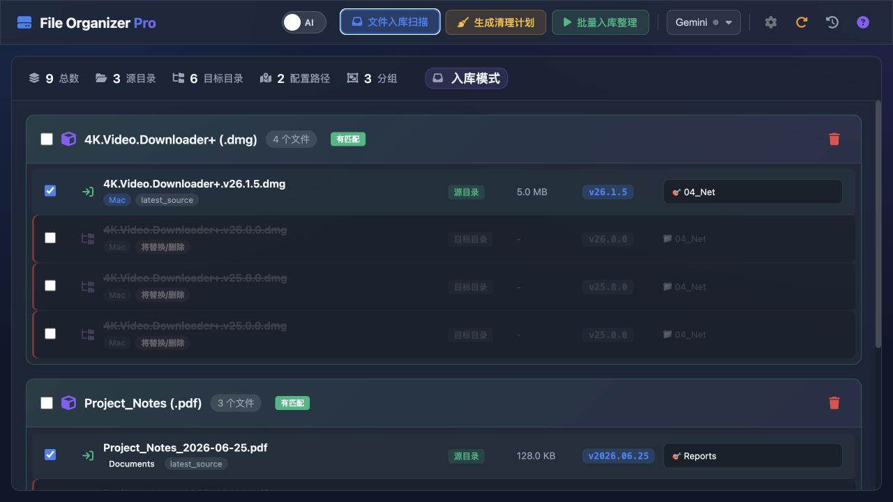
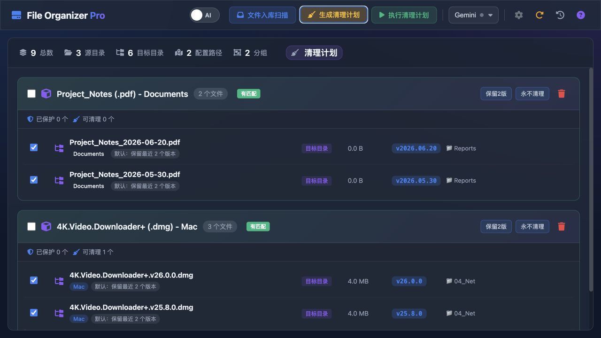
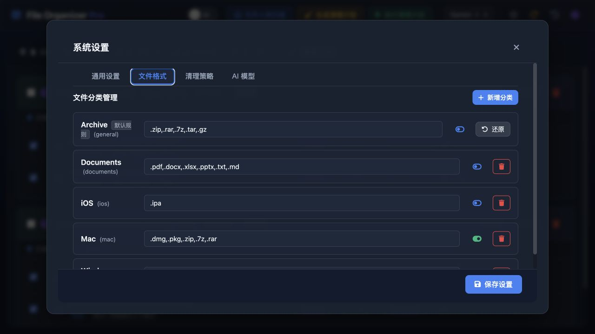

# File Organizer Pro

[](https://github.com/roanpy/file-organizer/actions/workflows/ci.yml)
[](CHANGELOG.md)
[](RELEASING.md)
[](https://github.com/roanpy/file-organizer/tags)
[](https://www.python.org/)
[](RELEASING.md)
[](LICENSE)

English first: [README.md](README.md)

**文件/文档/软件包管理助手，AI 作为可选增强**

默认面向应用/安装包管理，也可以新增文档、资料、压缩包等文件分类。软件包只是文件类型之一。



<p align="center"><sub>当前源码的实际运行界面，使用隔离演示目录和合成文件名；不包含真实项目、本机路径、API Key 或业务内容。</sub></p>

## 界面预览

### 清理计划



### 文件格式设置



项目采用源码优先的开源方式，核心代码使用 MIT License。AI 是可选增强，中文系统显示中文界面，其他系统默认显示英文界面。安全边界、依赖许可和发布流程见 [SECURITY.md](SECURITY.md)、[THIRD_PARTY_NOTICES.md](THIRD_PARTY_NOTICES.md) 和 [RELEASING.md](RELEASING.md)。

## ✨ 核心功能

- **智能扫描**：递归扫描源目录，默认识别常用文档、Mac、iOS、Windows 和压缩包格式
- **AI 分析**：可选调用 Gemini/DeepSeek/Ollama 辅助识别同款文件/软件的不同版本
- **性能优化**：引入规则预筛选与智能路径推荐，大幅降低 API 调用成本
- **版本管理**：智能分组展示，自动勾选最新版本
- **清理计划**：无需源文件，直接扫描目标目录查重，生成可确认的旧版本清理计划
- **保留策略**：支持按文件分组保留最近 N 个版本，或设置某个分组永不自动清理
- **跨格式查重**：支持忽略后缀去重（如 .pkg vs .dmg），也能将通用压缩包匹配到已有 Mac/iOS 目标分类
- **稳健名称匹配**：自动处理版本号、日期、平台后缀、发布标签、分隔符差异，减少同一文件分组漏匹配
- **变体隔离**：语言包、补丁、ARM64、Intel、Universal 版本分别管理，通用 `setup`/`installer` 文件按所在目录隔离，避免误清理
- **离线支持**：内置所有静态资源，无外部 CDN 依赖，支持内网/离线环境使用
- **一键清理**：批量删除旧版本，保留最新
- **智能转移**：参考已有路径或 AI 建议新路径
- **AI Agent 技能**：提取了独立的 `manage-software` Skill（见 `SoftwareOrganizer-Skill/`），全面兼容 OpenClaw / Claude Code 调用。

## 本项目解决的问题

- 名称匹配兼容标点、分隔符、版本标签、日期、平台后缀和打包格式差异，并避免把 `open-codesign`、`open-design` 这类相近名称误合并。
- 版本排序优先使用文件名中的明确版本号或日期；文档没有可识别版本时，使用文件系统修改日期作为可见的兜底依据。
- 清理计划区分保留、受保护、待替换和待删除项，可按分组、关键词、目录、变体或单个文件保留历史版本。
- AI 未配置、模型不可用或调用失败时，自动回退本地规则，不阻断扫描、匹配、清理计划、转移和安全确认。

## 系统特点

- **本地优先、源码优先**：核心流程在本机运行，Python 依赖精简，前端不依赖框架和外部 CDN。
- **AI 只是辅助**：Gemini、DeepSeek、Ollama 使用 HTTP 调用，核心功能不需要安装或打包 AI SDK。
- **操作可审核**：转移和删除受配置目录边界约束；覆盖同名文件必须在确认弹窗中显式选择；转移失败会阻止不安全的旧版清理。
- **自动适配语言**：`zh-*` 系统显示中文，其他系统显示英文；macOS 桌面版优先读取系统首选语言，再使用 Qt、环境变量和浏览器语言兜底，因此即使进程环境是 `C.UTF-8`，`zh-Hans-US` 仍会显示中文。翻译在本地完成，不上传界面内容，也不依赖在线翻译服务。

## 开发协作

本项目主要基于 OpenAI Codex 完成开发，其他 AI 编程 Agent 和本地 Agent 工作流协助专项实现、审查、测试、文档整理和发布核验。代码变更、依赖选择、安全检查和可能产生破坏性影响的操作仍需人工确认。

## 公开仓库边界

公开源码只包含代码、测试、文档和许可说明，不包含 API Key、`.env`、Shell 或 Agent 配置、真实本机主机名/IP、日志、数据库、模型文件、KV 缓存、下载文件、未核验授权的参考代码或本地打包产物。程序绑定本机服务所需的通用回环地址不属于用户识别信息。详见 [SECURITY.md](SECURITY.md) 和 [RELEASING.md](RELEASING.md)。

## 🛠 技术栈

- **后端**: Python + FastAPI
- **前端**: 原生 HTML/CSS/JavaScript
- **数据库**: SQLite
- **AI 引擎**: Gemini / DeepSeek / Ollama（可选，不安装也不影响扫描、匹配、转移）

## 📦 快速开始

### 1. 安装依赖

```bash
cd file-organizer
python3 -m venv .venv
source .venv/bin/activate
pip install -r requirements.txt
```

核心功能不依赖 AI SDK。Gemini、DeepSeek 和 Ollama 都使用内置 HTTP 调用；Gemini/DeepSeek 只需要配置 API Key，Ollama 只需要本地服务地址和模型名。只有自定义 LiteLLM Provider 需要按需安装可选依赖：

```bash
pip install litellm tenacity
```

### 2. 启动服务器

```bash
./scripts/start_web.sh
```

### 3. 访问应用

根据启动脚本输出的地址打开浏览器，默认是 [http://127.0.0.1:18001](http://127.0.0.1:18001)。

> 💡 **提示**: 如果端口已由 File Organizer 使用，脚本会复用该服务；如果被其他程序占用，会自动尝试 18002-18050，不会终止其他程序。

## 🧭 使用流程

### 文件入库扫描

1. 在设置中配置源目录和各分类目标目录。
2. 点击“文件入库扫描”，系统会先用本地规则匹配已有文件分组和推荐路径。
3. AI 默认关闭；开启后只作为增强层，用于补充目录建议、同款文件识别和未命中时的推荐判断。
4. 审核分组后点击“批量入库整理”，源目录中勾选的文件会被转移到目标目录。

### 生成清理计划

1. 点击“生成清理计划”，系统直接扫描目标目录中的历史版本和重复文件分组。
2. 默认每组保留最新版本，其余文件标记为可清理候选。
3. 如需保留历史版本，可使用“保留2版”“永不清理”或锁图标手动保留单个版本。
4. 点击“执行清理计划”前会展示确认信息；受保护版本不会进入删除队列。

## ⚙️ 配置说明

在设置页面配置以下路径：

| 配置项 | 说明 |
|--------|------|
| 源目录 | 扫描待整理文件的目录（如 `~/Downloads`） |
| 文档资料目标目录 | PDF、Office、文本和电子书等文档存放位置 |
| Mac 目标目录 | Mac 软件包存放位置 |
| iOS 目标目录 | iOS 应用包存放位置 |
| Windows 目标目录 | Windows 安装包存放位置 |

### 文件格式与版本判断

- **Mac**: `.dmg`, `.pkg`（可配置）
- **iOS**: `.ipa`（可配置）
- **Windows**: `.exe`, `.msi`（可配置）
- **文档资料**: `.pdf`, `.doc`, `.docx`, `.xls`, `.xlsx`, `.ppt`, `.pptx`, `.txt`, `.md`, `.epub`（可配置）。
- 版本判断优先使用文件名中的版本号或明确日期（如 `v1.2.0`, `2026-06-25`, `20260625`）；如果没有识别到版本或日期，则使用文件系统修改时间作为新旧兜底。
- 语言包、补丁和不同 CPU 架构会分组管理；`setup.exe` 等通用名称按所在目录隔离。

### AI 模型

AI 是辅助增强，不开启也可以正常扫描、匹配、查重、转移。支持以下 AI 引擎（需在设置中配置 API Key 或本地服务）：

- Google Gemini
- DeepSeek
- Ollama（本地）

Gemini、DeepSeek 和 Ollama 均通过 HTTP API 调用，打包版不需要额外携带对应 Python SDK。自定义 LiteLLM Provider 属于可选扩展，默认打包版不包含。

### 历史版本保留

在“生成清理计划”结果中，可以对单个文件分组设置：

- **保留2版**：以后该分组默认保留最近 2 个版本。
- **永不清理**：以后该分组所有历史版本都不会被批量清理。
- **取消策略**：恢复默认保留策略。

也可以在“设置 → 清理策略”中配置全局默认保留版本数、排除清理关键词和排除清理目录。

受保护版本会被锁定保留，批量处理时不会进入删除队列。

### 本地配置与安全

用户配置只保存在本机：

- `~/.software_organizer/software_organizer_config.json`
- `~/.software_organizer/software_organizer_history.json`
- `~/.software_organizer/keep_rules.json`
- `~/.software_organizer/retention_rules.json`
- `~/.software_organizer/app.log` / `server.log`

这些文件不提交到 GitHub，并以仅当前用户可读的权限保存。`/api/config` 默认只返回配置状态和掩码，不会把真实 API Key 原样返回给前端页面；保存模型配置时，如果 API Key 输入框留空，会保留原有 Key。

## 📚 维护文档

- [批量处理逻辑说明](docs/batch_processing_logic.md)
- [2026-05-20 清理计划、安全加固与打包核验记录](docs/maintenance_log_2026_05_20.md)
- [2026-05-21 流程优化与依赖核查记录](docs/maintenance_log_2026_05_21.md)
- [2026-07-16 全面审查、安全优化与发布记录](docs/maintenance_log_2026_07_16.md)
- [性能优化与重构总结](docs/optimization_and_refactor_2026_01_12.md)

## 📁 项目结构

```
file-organizer/
├── src/
│   ├── server.py              # FastAPI 服务器
│   └── software_organizer/    # 核心业务模块
│       ├── config.py          # 配置管理
│       ├── file_ops.py        # 文件操作
│       ├── ai_engines.py      # AI 引擎
│       ├── transfer.py        # 转移/删除
│       └── database.py        # 数据库
├── static/
│   ├── index.html             # 主页面
│   ├── app.js                 # 前端逻辑
│   ├── i18n.js                # 系统语言适配
│   └── style.css              # 样式表
├── tests/                     # 单元和安全测试
└── docs/                      # 流程与维护记录
```

## 🔧 开发说明

### 代码规范

- Python: Type Hints + Ruff
- JavaScript: ES Modules
- 中文注释和文档

### 运行测试

```bash
source .venv/bin/activate
python -m unittest discover -s tests -v
```

### 依赖核查

```bash
python -m pip check
python -m pip list --outdated --format=json
```

当前直接依赖保持精简并限制在兼容主版本范围内：核心功能依赖 FastAPI/Uvicorn/Pydantic/pywebview，打包依赖 PyInstaller/Pillow；Gemini、DeepSeek、Ollama 使用 HTTP 调用，不需要把对应 SDK 打进应用。当前环境已核验 FastAPI 0.141.1、Uvicorn 0.52.1、Pydantic 2.13.4、Pillow 12.3.0、pywebview 6.2.1 和 PyInstaller 6.22.0。

## 📦 打包构建

### Mac 平台

```bash
# 构建独立应用 (.app)
./scripts/build_standalone.sh
```

构建脚本默认只打包核心功能依赖，AI SDK 不会强制打进应用。需要安装到系统应用目录时：

```bash
rm -rf /Applications/FileOrganizer.app /Applications/SoftwareOrganizer.app
cp -R dist/FileOrganizer.app /Applications/
```

### Windows 平台

```cmd
REM 构建独立应用 (.exe)
scripts\build_windows.bat
```

### GitHub Actions

本项目包含 GitHub Workflows，支持在 GitHub 上自动构建 Windows 和 Mac 应用。
只需推送标签 (v*) 即可触发构建。

## 📝 许可证

MIT License

## 🙏 致谢

参考文件整理类项目的本地优先设计，当前代码和运行逻辑独立维护。
